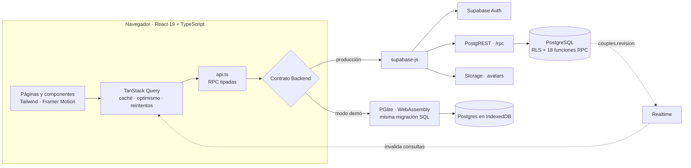
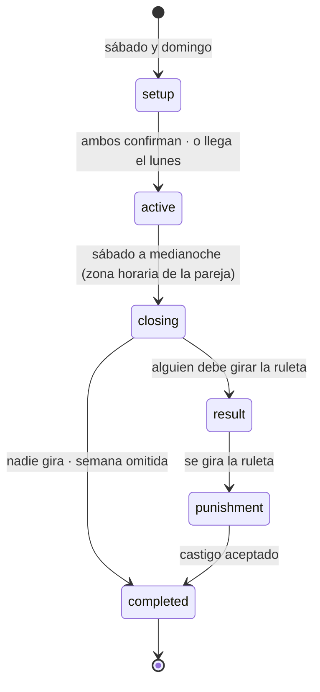

# Nuestra Semana — Metas semanales en pareja con competencia amistosa


Aplicación web para que dos personas en pareja se pongan metas cada semana y compitan con cariño. El domingo, cada quien define sus metas de lunes a viernes y escribe de 3 a 5 castigos para su pareja. Entre semana, cada quien marca solo sus propias tareas y solo las del día. El viernes se cierra la semana: quien tenga el porcentaje más bajo gira una ruleta con los castigos que escribió quien ganó.

El sistema combina tres capas:

1. **Interfaz en React** — experiencia móvil y de escritorio con animaciones, actualizaciones optimistas y sincronización en tiempo real entre los dos teléfonos.
2. **Reglas de negocio en PostgreSQL** — toda la lógica vive en la base de datos (Supabase), protegida con *Row Level Security* y funciones RPC que validan cada acción con el reloj del servidor.
3. **La misma base de datos en el navegador** — la migración SQL de producción corre en WebAssembly ([PGlite](https://pglite.dev)) para el modo demo y para las pruebas automatizadas.

> **English summary:** Weekly-goals web app for couples. Each Sunday both partners set Monday–Friday goals and write 3–5 "punishments" for each other; on Friday the server closes the week, compares completion percentages, and the loser spins a roulette whose result is chosen server-side with unbiased cryptographic randomness. React 19 + TypeScript front end; all business rules live in PostgreSQL (Supabase) behind Row Level Security and `SECURITY DEFINER` RPCs that validate identity, membership, week state and server time. The same SQL migration runs in the browser via PGlite (WebAssembly) for a demo mode and powers a 60-test suite.

<p align="center">
  
</p>
<p align="center">
  
  
</p>
<p align="center">
  
</p>

<sub>Capturas del modo demo con datos de ejemplo (Dani y Sami).</sub>

---

## Arquitectura



El cliente nunca escribe directamente en una tabla: llama funciones RPC. Esas funciones viven en la base de datos y son la única fuente de verdad de las reglas. El mismo contrato `Backend` tiene dos implementaciones: Supabase en producción y PGlite en el modo demo. Así, la interfaz no sabe ni le importa contra cuál está hablando.

| Módulo | Tecnología | Responsabilidad |
|---|---|---|
| [`supabase/migrations/…_nuestra_semana.sql`](supabase/migrations/20260928000000_nuestra_semana.sql) | PostgreSQL · PL/pgSQL | 16 tablas, políticas RLS y 18 funciones RPC con toda la lógica: calendario, cierre de semana, resultados, logros, correcciones y ruleta. |
| [`supabase/migrations/…_supabase_platform.sql`](supabase/migrations/20260928000001_supabase_platform.sql) | Supabase | Publicación de Realtime y bucket `avatars` con políticas por carpeta de usuario. |
| [`src/domain/`](src/domain) | TypeScript puro | Fechas por zona horaria, cálculo de progreso, validaciones (espejo de las del servidor), calendario de la semana y geometría de la ruleta. |
| [`src/services/`](src/services) | TypeScript | Contrato `Backend` (Supabase o demo), API tipada de las RPC y normalización de errores. |
| [`src/state/`](src/state) | TanStack Query | Sesión, consultas, mutaciones optimistas con reversión, suscripción en tiempo real y retroalimentación (sonido, confeti, vibración). |
| [`src/components/`](src/components) · [`src/pages/`](src/pages) | React · Tailwind CSS 4 · Framer Motion | Interfaz: avatares SVG con 6 estados de ánimo, ruleta SVG, gráfica accesible, navegación inferior en móvil y lateral en escritorio. |
| [`src/demo/`](src/demo) | PGlite | Modo demo: ejecuta la migración real en el navegador, con reloj simulado y datos generados mediante las mismas RPC. |
| [`tests/`](tests) | Vitest | Pruebas contra la base de datos real: semanas completas, RLS, privacidad y aleatoriedad. |
| [`vite.config.ts`](vite.config.ts) | Vite | Elige el backend al compilar, excluye el modo demo de producción y detiene la compilación si detecta una clave secreta. |

---

## Ciclo de vida de una semana



| Estado | Qué permite el servidor |
|---|---|
| `setup` | Cada quien guarda sus metas (1 a 10, de 1 a 5 días cada una, en días fijos o flexibles) y de 3 a 5 castigos para su pareja. Al confirmar, ya no se pueden editar. |
| `active` | Cada quien marca **solo sus** tareas y **solo las de hoy**. Los días pasados quedan bloqueados; cambiarlos requiere una corrección que la pareja debe aprobar. Quien no configuró a tiempo puede sumarse con los días que quedan. |
| `closing` | Estado transitorio: la semana se bloquea (`SELECT … FOR UPDATE`) mientras se calculan los resultados, para que nunca se cierre dos veces. |
| `result` → `punishment` → `completed` | Ruleta pendiente, castigo elegido pendiente de aceptar y semana registrada en el historial. |

No hay tareas programadas: cada vez que alguien abre la app, `get_state()` llama a `sync_weeks()`. Esta función cierra las semanas cuyo viernes ya pasó y prepara la siguiente. Es idempotente y segura ante accesos simultáneos.

---

## Cómo se decide el resultado

Cada **meta** pesa lo mismo, sin importar cuántos días tenga:

```
porcentaje = promedio( min(días cumplidos, días objetivo) / días objetivo )

Gym 4/5 · Francés 5/5 · Security+ 3/5 · Comer sano 5/5  →  (80 + 100 + 60 + 100) / 4 = 85 %
```

Se comparan los porcentajes **redondeados**, que son los que ven los usuarios:

| Situación | Resultado |
|---|---|
| Porcentajes distintos | Pierde el menor y gira la ruleta con los castigos que escribió quien ganó. |
| Empate · regla «ambos giran» (por defecto) | Los dos giran, cada uno con los castigos del otro. |
| Empate · regla «más tareas completadas» | Gana quien completó más tareas; si también empatan, giran los dos. |
| Empate · regla «nadie gira» | La semana se registra sin castigo. |
| Alguien no configuró su semana | Termina con 0 %. |
| Ninguno configuró | La semana se omite. |

Solo se gira la ruleta si la otra persona participó y dejó al menos 3 castigos confirmados. Las rachas cuentan semanas consecutivas por encima de un umbral configurable (80 % por defecto). Los logros (semana perfecta, 5 duelos ganados, buen perdedor…) los otorga el servidor automáticamente.

---

## Modelo de seguridad

Todas las tablas tienen **Row Level Security** y solo tienen políticas de **lectura**:

| Datos | Quién puede leerlos |
|---|---|
| Perfil | La persona y su pareja. |
| Metas, cumplimientos, semanas, resultados, ruletas, correcciones y logros | Solo los dos miembros de la pareja. |
| Preferencias personales | Solo su dueño. |
| **Castigos** | Quien los escribió. Quien los recibe, **solo** cuando perdió esa semana y le toca girar. |

A los clientes se les revocan `insert`, `update` y `delete`. Toda escritura pasa por una función `SECURITY DEFINER` con `search_path` vacío, que valida identidad (`auth.uid()`), pertenencia a la pareja, estado de la semana y **la fecha del servidor en la zona horaria de la pareja**. El teléfono nunca decide qué día es, así que cambiar la hora del dispositivo no sirve para hacer trampa.

| RPC | Validaciones principales |
|---|---|
| `save_goals` · `save_punishments` · `confirm_setup` | La semana está en preparación y no la has confirmado. Los castigos van dirigidos a tu pareja y pasan un filtro de seguridad (el mismo en cliente y servidor, con prueba de paridad). |
| `set_completion` | Solo metas propias, solo hoy y solo en días programados. En las metas flexibles («3 días, cualquier día»), no permite pasar del objetivo. |
| `request_correction` · `resolve_correction` | Un día pasado solo cambia si la pareja lo aprueba. Puede haber una sola solicitud pendiente por meta y día. |
| `spin_roulette` · `accept_punishment` | La semana está cerrada, te toca girar y no has girado antes (restricción `UNIQUE`). El castigo lo elige el servidor. |
| `join_couple` | Código válido de 6 caracteres, con bloqueo de fila para que nunca haya más de dos miembros. |

Además:
- **Sin sesión no hay acceso a nada:** cualquier consulta anónima a tablas o funciones responde `permission denied`.
- **Permisos explícitos:** la migración no depende de los privilegios por defecto del proyecto.
- **Solo claves públicas en el cliente:** la compilación se detiene si la configuración contiene una clave `secret` o `service_role`.
- **Lecturas de solo lectura:** las RPC de lectura (`STABLE`) corren en transacciones de solo lectura, como en PostgREST.
- **Contraseñas:** las gestiona Supabase Auth; la app nunca las almacena.
- **Fotos de perfil:** cada usuario solo puede escribir en su propia carpeta del bucket.

---

## Ruleta con aleatoriedad verificable

El índice del castigo lo elige PostgreSQL, no el navegador:

```sql
v_limit := (4294967296 / p_n) * p_n;   -- mayor múltiplo de n que cabe en 2^32
loop
  v := ('x' || substr(replace(gen_random_uuid()::text, '-', ''), 1, 8))::bit(32)::bigint;
  exit when v < v_limit;               -- muestreo por rechazo: sin sesgo de módulo
end loop;
return v % p_n;
```

- `gen_random_uuid()` usa el generador criptográfico del servidor. Los primeros 8 dígitos hexadecimales de un UUID v4 son 32 bits aleatorios.
- El **muestreo por rechazo** descarta los valores que causarían sesgo de módulo, así que cada castigo tiene exactamente la misma probabilidad.
- El resultado se guarda con su índice y el número de segmentos en `roulette_results`. La restricción `UNIQUE (week_id, spinner_id)` garantiza un solo giro por persona y semana.
- La animación (6 a 8 vueltas y 5 a 7 segundos) aterriza en un punto al azar **dentro** del segmento elegido por el servidor, así que lo que se ve coincide con lo que se registró.
- Una prueba **chi-cuadrado** verifica la uniformidad de la distribución.

---

## Sincronización en tiempo real

1. Cada RPC que cambia algo llama a `_touch()`, que incrementa `couples.revision`.
2. El cliente está suscrito por Supabase Realtime a los cambios de **su** fila de pareja (Realtime respeta RLS).
3. Al llegar el evento, TanStack Query invalida las consultas y la pantalla de la pareja se actualiza en segundos.
4. Marcar una tarea es **optimista**: la interfaz responde al instante. Si el servidor rechaza el cambio, se revierte y aparece un aviso para reintentar.
5. Una consulta cada 60 segundos detecta el cambio de día a medianoche.

---

## Modo demo: la misma base de datos dentro del navegador

- **PGlite** (Postgres compilado a WebAssembly) ejecuta la migración de producción **sin cambios**. Un pequeño *shim* recrea lo que Supabase ya trae: los roles `anon` y `authenticated`, la tabla `auth.users` y `auth.uid()` leyendo el claim del JWT.
- Toda regla de calendario usa `app_now()`. En el demo, esa función se redefine con un desfase, lo que permite viajar en el tiempo: pasar al siguiente día, cerrar la semana o ir al domingo.
- Cada RPC se ejecuta como lo haría PostgREST: dentro de una transacción, con `set local role authenticated`, el claim del usuario y modo de solo lectura para las funciones `STABLE`.
- Los datos de ejemplo (6 semanas de historia) se generan llamando a las **mismas RPC** con viajes en el tiempo y un generador pseudoaleatorio con semilla fija.
- La base se crea en memoria y se vuelca a IndexedDB con durabilidad estricta. Un *Web Lock* evita que dos pestañas la abran a la vez, y el nombre de la base incluye un hash del SQL, así que un cambio de esquema crea una base nueva.
- Al compilar para producción, un alias de Vite reemplaza el backend demo por un módulo vacío. El build de producción pesa **~1.3 MB**, frente a **~18 MB** con PGlite.

---

## Pruebas y verificación

**60 pruebas automatizadas (Vitest)**, la mayoría contra la base de datos real:

- **Semanas completas con reloj simulado:** domingo → configuración → lunes a viernes → cierre → resultado → ruleta → historial.
- **Reglas del juego:** empates con cada regla, configuración tardía, metas flexibles, correcciones que solo se aplican con la aprobación de la pareja, rachas, logros y el ejemplo del 85 %.
- **Privacidad:**
  - nadie fuera de la pareja puede leer ni tocar sus datos;
  - nadie escribe directamente en las tablas;
  - cada quien marca solo lo suyo y solo lo de hoy;
  - los castigos permanecen ocultos hasta la ruleta.
- **Aleatoriedad:** uniformidad de la ruleta con chi-cuadrado.
- **Dominio y errores:** fechas, progreso, validaciones y mensajes de error de autenticación.

La migración también se verificó en **Postgres 16, 17 y 18** y con los privilegios por defecto de Supabase. Esto incluye el cambio de 2026, con el que las tablas nuevas dejaron de exponerse automáticamente en la API.

---

## Interfaz y experiencia

- **Avatares ilustrados en SVG** con 6 estados de ánimo según el progreso (de 0 % a 100 %), rebote y partículas al avanzar, y confeti al completar la semana.
- **Mensajes motivacionales** por rangos de avance y una frase del día.
- **Gráfica de historial accesible:**
  - paleta validada para daltonismo;
  - series diferenciadas también por la forma del marcador;
  - tooltip con navegación por teclado y vista alternativa en tabla.
- **Accesibilidad:**
  - tareas con `role="checkbox"` e interruptores con `role="switch"`;
  - modales con foco atrapado y enlace para saltar al contenido;
  - respeta `prefers-reduced-motion`.
- **PWA instalable:** íconos para iOS y Android y diseño *mobile-first*, con barra inferior en móvil y barra lateral en escritorio.

---

## Limitaciones y trabajo futuro

- **Cierre al abrir la app:** la semana se cierra cuando alguno abre la app después del viernes. El resultado es el mismo, pero no hay avisos automáticos.
- **Sin notificaciones push ni modo sin conexión:** la app se instala como PWA, pero aún no tiene *service worker*.
- **Exactamente dos personas por pareja** y una pareja por usuario, por diseño.
- **Una zona horaria por pareja:** si viven en husos distintos, rige la configurada para la pareja.
- **Filtro de castigos por palabras clave:** es una barrera de cortesía, no moderación de contenido.
- **Sin cifrado de extremo a extremo:** los datos viajan cifrados (HTTPS), pero el proveedor de la base de datos podría acceder a ellos.

## Conceptos aplicados

Row Level Security · funciones `SECURITY DEFINER` · máquina de estados en SQL · manejo de zonas horarias · concurrencia con `SELECT … FOR UPDATE` · muestreo por rechazo · actualizaciones optimistas · tiempo real con Postgres changes · WebAssembly (PGlite) · pruebas de integración contra base de datos real · accesibilidad (WAI-ARIA) · visualización de datos accesible · PWA.

## Autor

**Erick Terrazas** — [@S1natraa](https://github.com/S1natraa)

## Licencia

© 2026 Erick Terrazas. **Todos los derechos reservados.** El código se publica únicamente para consulta, como parte de mi portafolio. No se concede permiso para copiarlo, modificarlo, distribuirlo ni usarlo. Consulta [LICENSE](LICENSE).
