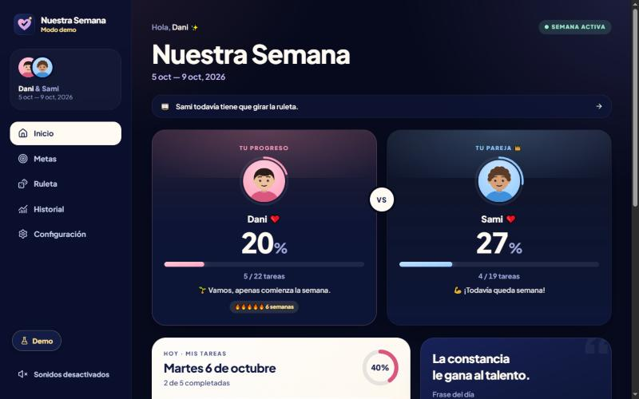
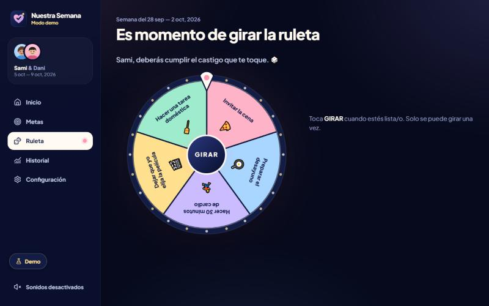
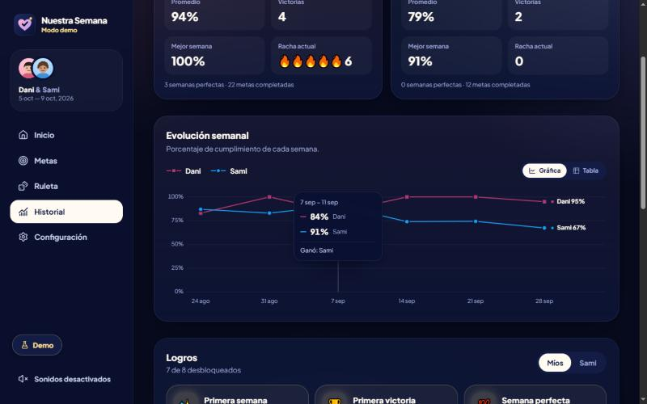
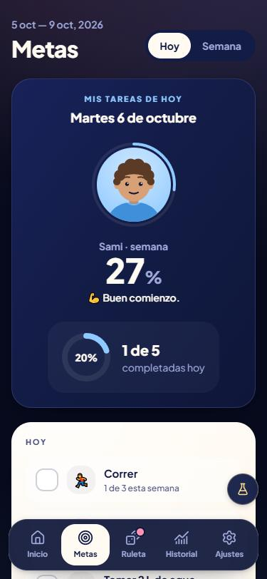

# Nuestra Semana ❤️

App web para que dos personas en pareja definan metas cada domingo, las cumplan de lunes a viernes y compitan con cariño: quien termina la semana con menor porcentaje gira una ruleta con los castigos que preparó su pareja.

**Stack:** React 19 · TypeScript · Vite · Tailwind CSS 4 · Framer Motion · TanStack Query · Supabase (Auth, PostgreSQL, RLS, Realtime, Storage).

<p align="center">
  
</p>
<p align="center">
  
  
</p>
<p align="center">
  
</p>

<sub>Capturas del modo demo con datos de ejemplo.</sub>

## Destacados técnicos

- **Seguridad en la base de datos:** Row Level Security en todas las tablas y el cliente solo puede leer. Toda escritura pasa por funciones `SECURITY DEFINER` que validan la identidad, la pertenencia a la pareja, el estado de la semana y la fecha del servidor en la zona horaria de la pareja.
- **Una sola fuente de verdad:** la misma migración SQL corre en Supabase y, en WebAssembly ([PGlite](https://pglite.dev)), dentro del navegador para el modo demo y en las pruebas.
- **Ruleta realmente aleatoria:** el servidor elige con `gen_random_uuid()` y muestreo por rechazo, sin sesgo y verificado con chi-cuadrado. La animación aterriza en ese resultado.
- **Pruebas:** 60 pruebas automatizadas, incluidas semanas completas con reloj simulado, la privacidad de los castigos y RLS. Compatibilidad verificada en Postgres 16, 17 y 18.
- **Experiencia:** actualizaciones optimistas, tiempo real entre los dos dispositivos, PWA instalable, diseño responsive y accesible (teclado, lectores de pantalla, movimiento reducido).

---

## Arranque rápido (modo demo)

```bash
npm install
npm run dev
```

Abre http://localhost:5173. Sin credenciales de Supabase la app arranca en **modo demo**:

- Corre la **misma migración SQL de producción** dentro de una base Postgres real en el navegador ([PGlite](https://pglite.dev)), así que las reglas, validaciones y la seguridad (RLS) son idénticas a las de Supabase.
- Trae datos de ejemplo de Dani y Sami (6 semanas de historia, rachas, logros y una ruleta pendiente). Se generan usando las mismas funciones RPC que usa la app.
- El botón **Demo** permite cambiar de persona y **avanzar el reloj** (siguiente día, cerrar la semana, ir al domingo/lunes) para probar todo el ciclo sin esperar.
- Los datos viven solo en ese navegador (IndexedDB). "Reiniciar demo" vuelve al presente con datos nuevos.

El modo demo está claramente separado: con Supabase configurado **no se incluye en el build** (ni PGlite ni los datos de ejemplo). Si ya tienes `.env.local`, `npm run dev:demo` abre el demo sin leer tus credenciales.

## Publicar (Supabase + Netlify)

1. **Supabase:** crea un proyecto en [supabase.com](https://supabase.com) (deja la *Data API* activada, como viene).
2. **SQL Editor:** ejecuta cada archivo, en orden, en su propia consulta (o `supabase db push` con la CLI):
   - `supabase/migrations/20260928000000_nuestra_semana.sql` — esquema, reglas de negocio, RLS y funciones.
   - `supabase/migrations/20260928000001_supabase_platform.sql` — Realtime y el bucket `avatars` de Storage.

   Todos los permisos son explícitos, así que funciona también en los proyectos nuevos, que ya no exponen las tablas automáticamente. Está probado en Postgres 16, 17 y 18.
3. **`.env.local`:** pega la *Project URL* y la *Publishable key* (botón **Connect** del proyecto). Si pegas una clave secreta (`sb_secret_…` o `service_role`) o la dirección del panel, la compilación se detiene con un aviso.
4. **`npm run build`:** debe decir `✓ Build de producción conectado a Supabase`. El resultado queda en `dist/` e incluye `_redirects` (para que las rutas funcionen al recargar), `_headers` (encabezados de seguridad) y los íconos para la pantalla de inicio.
5. **Netlify:** con tu cuenta iniciada, arrastra la carpeta `dist` a [app.netlify.com/drop](https://app.netlify.com/drop). Para actualizar: `npm run build` y arrastra `dist` en la pestaña **Deploys** del proyecto.
6. **Authentication → URL Configuration:** en *Site URL* va tu dirección de Netlify, y en *Redirect URLs* agrega `https://tu-sitio.netlify.app/**`.
7. **Authentication → Sign In / Providers:** para dos personas conviene desactivar **Confirm email**, porque el correo gratuito de Supabase envía como máximo 2 mensajes por hora. Cuando los dos tengan cuenta, desactiva **Allow new users to sign up**.

Cada persona crea su cuenta, una crea la pareja y comparte el enlace `/unirse/CÓDIGO`, y la otra se une. En el plan gratuito, Supabase pausa el proyecto tras 7 días sin uso; se reactiva desde el panel.

## Cómo funciona una semana

| Momento | Estado | Qué pasa |
|---|---|---|
| Sábado y domingo | `setup` | Cada quien configura sus metas (1–10) y 3–5 castigos para su pareja. Al confirmar ya no se pueden editar. Cuando ambos confirman → `active` ("Los dos están listos"). |
| Lunes a viernes | `active` | Cada quien marca **solo sus** tareas y **solo las de hoy**. Los días pasados quedan bloqueados. |
| Sábado 00:00 | `closing` → `result` | El servidor calcula porcentajes, ganador/perdedor y quién gira. |
| Ruleta girada | `punishment` | Castigo elegido al azar por el servidor, pendiente de aceptar. |
| Castigo aceptado | `completed` | Queda registrado en el historial. |

- **Porcentaje:** cada **meta** pesa lo mismo: promedio de `min(días cumplidos, objetivo) / objetivo`. Ej.: Gym 4/5, Francés 5/5, Security+ 3/5, Comer sano 5/5 → (80+100+60+100)/4 = **85 %**.
- **Metas flexibles:** "3 días, cualquier día" cuenta hasta llegar a 3; las de días fijos solo se marcan esos días.
- **Empate** (mismo porcentaje redondeado): configurable — *ambos giran* (por defecto), *gana quien completó más tareas* o *nadie gira*.
- **Quien no configura su semana** termina con 0 %. Si ninguno configura, la semana se omite.
- **Configuración tardía:** si la semana ya empezó y aún no la configuraste, puedes sumarte con los días que quedan.
- **Correcciones:** si alguien marcó algo por error, pide una corrección de un día pasado (Configuración → "Corregir una tarea"); solo se aplica si la pareja la aprueba.
- **Rachas:** semanas consecutivas con al menos el porcentaje configurado (80 % por defecto). **Logros** automáticos: primera victoria, semana perfecta, 3 y 5 semanas en racha, 10 metas completadas, 5 duelos ganados, buen perdedor…

## Seguridad

- **RLS en todas las tablas.** Los clientes solo pueden **leer** lo que les corresponde; no hay políticas de escritura.
- **Toda escritura pasa por funciones RPC** (`SECURITY DEFINER`, `search_path` vacío) que validan identidad, pertenencia a la pareja, estado de la semana y **la fecha actual en la zona horaria de la pareja** (el cliente nunca decide qué día es).
- **Castigos secretos:** los ve quien los escribió; quien los recibe, solo cuando pierde y le toca girar (política RLS en `punishments`).
- **Ruleta:** el índice lo elige el servidor con aleatoriedad criptográfica (`gen_random_uuid()` + muestreo por rechazo, sin sesgo). Un solo giro por persona y semana (restricción única). La animación aterriza en ese segmento, en un punto aleatorio.
- Filtro de castigos peligrosos/ilegales/humillantes en cliente **y** servidor, además del aviso visible.
- Contraseñas: solo Supabase Auth (la app nunca las guarda).
- Solo claves públicas en el cliente: `vite.config.ts` detiene el arranque y la compilación si `.env.local` trae una clave secreta.
- Las lecturas `STABLE` corren en transacciones de solo lectura, igual que en PostgREST. El modo demo y las pruebas lo reproducen.

## Estructura

```
supabase/migrations/     Esquema PostgreSQL, RLS y funciones RPC (fuente de verdad)
src/domain/              Lógica pura: fechas, progreso, validaciones, calendario, ruleta
src/services/            Contrato de backend, Supabase, API tipada, errores
src/demo/                Modo demo: PGlite, reloj simulado, datos de ejemplo
src/state/               Proveedores y hooks (sesión, consultas, comandos, toasts, feedback)
src/components/          UI reutilizable (AvatarProgress, ProgressBar, GoalCard, DailyTask,
                         GoalEditor, PunishmentEditor, WeeklyScore, WeeklyResult, Roulette,
                         RouletteResult, StatsCard, HistoryChart, AchievementBadge,
                         BottomNavigation, Sidebar, WeekStatus, MotivationalMessage,
                         ConfettiEffect…)
src/pages/               Pantallas (Inicio, Metas, Configurar, Resultado, Ruleta, Historial,
                         Configuración, autenticación y bienvenida)
tests/                   Pruebas de la base de datos real y del seed
docs/screenshots/        Capturas del modo demo para este README
```

## Scripts

| Comando | Qué hace |
|---|---|
| `npm run dev` | Servidor de desarrollo (demo si no hay `.env.local`) |
| `npm run dev:demo` | Modo demo siempre, sin leer `.env.local` |
| `npm test` | Pruebas: dominio, **migración SQL real con RLS** (semanas completas con reloj simulado) y seed demo |
| `npm run typecheck` | TypeScript estricto |
| `npm run build` | Build de producción en `dist/` |
| `npm run build:demo` | Demo pública en `dist-demo/`, sin credenciales |

Las pruebas de base de datos recorren semanas completas (domingo → lunes…viernes → cierre → resultado → ruleta → historial), incluidos empates, configuración tardía, correcciones, privacidad de castigos, RLS y la uniformidad de la ruleta (chi-cuadrado).
